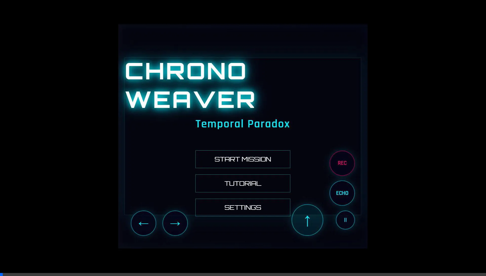
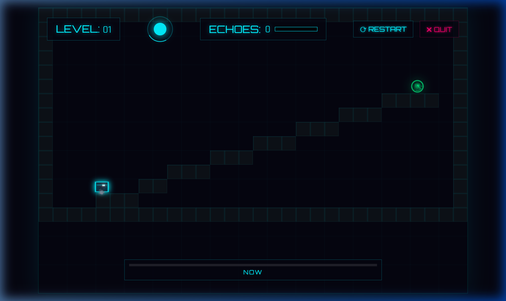
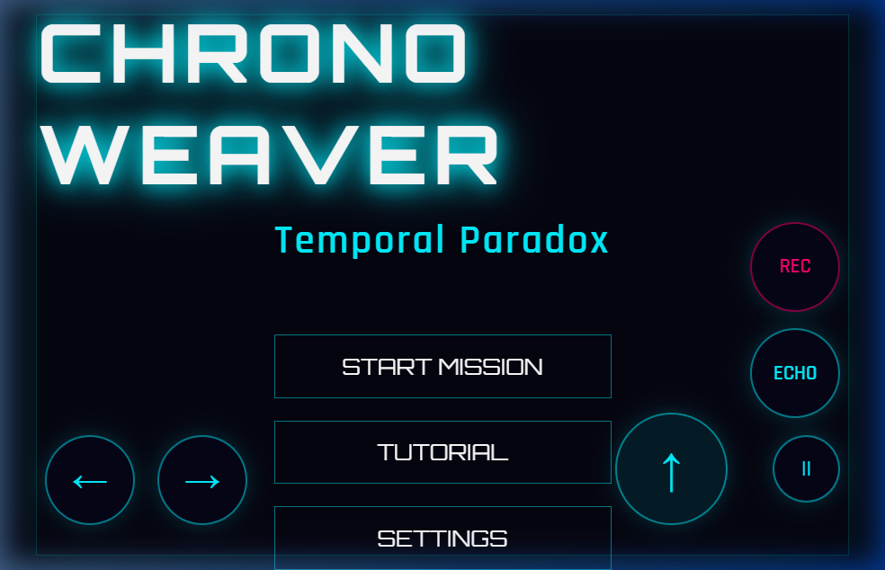

<p align="center">
	
</p>

<h1 align="center">Chrono Weaver: Temporal Paradox</h1>

<p align="center">
	A cinematic timeline puzzle-platformer built with pure web tech.<br />
	Record the present. Rewind the past. Solve the impossible.
</p>

<p align="center">
	
	
	
	
</p>

<p align="center">
	<a href="https://rahul-panda564.github.io/Chrono_Weaver/">
		
	</a>
</p>

---

## Table of Contents

- [Project Snapshot](#project-snapshot)
- [For Recruiters](#for-recruiters)
- [Role Fit Mapping](#role-fit-mapping)
- [Tech Stack](#tech-stack)
- [Live Demo](#live-demo)
- [Screenshots](#screenshots)
- [Media Update Workflow](#media-update-workflow)
- [Gameplay Pillars](#gameplay-pillars)
- [How It Plays](#how-it-plays)
- [Controls](#controls)
- [Run Locally](#run-locally)
- [Architecture](#architecture)
- [Roadmap](#roadmap)
- [Release Notes](#release-notes)
- [License](#license)

---

## Project Snapshot

Chrono Weaver is a 2D puzzle-platformer where time is your primary tool.

Instead of brute-force movement challenges, each sector asks you to choreograph timeline actions:

- Record movement paths.
- Spawn echoes that replay those paths.
- Hold pressure plates with ghosts while your present self advances.
- Manage timing, hazards, and gate sequencing across handcrafted levels.

The result is a clean but deep loop that rewards planning, rhythm, and experimentation.

---

## For Recruiters

This project is positioned as a portfolio-ready gameplay engineering sample.

- Designed and shipped a complete browser game loop from concept to playable release.
- Implemented timeline recording and deterministic ghost replay for puzzle solving.
- Built a modular codebase with clear boundaries across entities, systems, UI, and level logic.
- Delivered cross-device accessibility with keyboard, touch, and partial gamepad support.
- Authored visual documentation and architecture notes suitable for technical review.

If you are reviewing this repository for internships or roles, this project highlights practical JavaScript problem solving, gameplay system design, and product-level polish.

---

## Role Fit Mapping

| Target Role | What This Repo Demonstrates |
|---|---|
| Frontend Developer Intern | Real-time state updates, responsive UI layers, event-driven input handling, and rendering performance awareness |
| JavaScript Developer | OOP architecture in plain JS, system decomposition, clean game-loop orchestration, and browser API usage |
| Gameplay Programmer Intern | Deterministic record/replay mechanic, level progression design, player feedback loops, and puzzle systems thinking |
| Full Stack Intern (Portfolio Signal) | Product ownership from concept to shipped build, documentation clarity, and maintainable project structure |

---

## Tech Stack

- HTML5 Canvas rendering
- Vanilla JavaScript (ES6 classes, modular folder structure)
- CSS3 for HUD, menu states, and responsive mobile controls
- No external game engine

---

## Live Demo

- Visit Website: [Play Chrono Weaver](https://rahul-panda564.github.io/Chrono_Weaver/)

---

## Portfolio Value

This project demonstrates practical game-engine thinking using only vanilla JavaScript.

- Systems Design: deterministic record/rewind loop with replayable ghost entities.
- Gameplay Engineering: puzzle readability, progression pacing, and fail-state recovery.
- UI/UX Delivery: responsive HUD, menu flow, and touch-first control overlays.
- Technical Discipline: modular folder architecture and maintainable subsystem boundaries.

If you are reviewing this as a hiring manager or collaborator, Chrono Weaver showcases end-to-end ownership from gameplay concept to polished browser delivery.

---

## Screenshots

### Main Gameplay View



### Mobile Interface



### In-Action Preview


> Tip: if images do not render on GitHub, verify the `assets/` folder and file names are unchanged.

---

## Media Update Workflow

Use this process to keep your GitHub visuals fresh after gameplay or UI updates.

### 1) Capture New Screenshots

- Desktop gameplay: save as `assets/gameplay.png`
- Mobile controls view: save as `assets/mobile_ui.png`

Recommended export:

- PNG format
- 16:9 framing
- Keep width between 1280 and 1920 for GitHub readability

### 2) Record Demo Clip

- Record 8 to 12 seconds of gameplay as MP4 (for example, with OBS)
- Save source clip as `assets/demo_source.mp4` (optional local source)

### 3) Convert MP4 to WebP (lightweight animation)

Using ffmpeg directly:

```bash
ffmpeg -i assets/demo_source.mp4 -vf "fps=15,scale=960:-1:flags=lanczos" -loop 0 -an assets/mobile_demo.webp
```

Or run the bundled script:

```powershell
powershell -ExecutionPolicy Bypass -File scripts/update-demo-webp.ps1
```

### 4) Validate in README

- Confirm `assets/mobile_demo.webp` renders on GitHub
- Ensure screenshot file names are unchanged to avoid broken links

### 5) Commit Media Refresh

```bash
git add assets/gameplay.png assets/mobile_ui.png assets/mobile_demo.webp README.md
git commit -m "docs: refresh portfolio screenshots and demo media"
git push origin main
```

---

## Gameplay Pillars

### 1) Temporal Recording

Capture your actions in real time and convert them into replayable ghost logic.

### 2) Echo-Oriented Puzzle Solving

Echoes can operate mechanisms while you traverse alternate routes.

### 3) Escalating Sector Design

10 progressive levels introduce multi-gate chains, vertical routing, and hazard pressure.

### 4) Readable Sci-Fi HUD

Live level data, timeline status, and echo capacity are always visible in a compact interface.

### 5) Multi-Input Support

Keyboard, touch controls, and gamepad mappings keep play accessible across desktop and mobile.

---

## How It Plays

1. Assess the room, then identify gate and plate dependencies.
2. Press record and perform a path your echo will later replay.
3. Trigger rewind to spawn a ghost from the recording.
4. Use the ghost to hold mechanisms while you take a new route.
5. Reach the exit portal to complete the sector.

Practical constraints:

- Echo capacity: 5 active ghosts.
- Recording cap: about 10 seconds per capture window.

---

## Controls

### Keyboard

| Action | Input |
|---|---|
| Move Left | A or Left Arrow |
| Move Right | D or Right Arrow |
| Jump | Space, W, or Up Arrow |
| Record Start/Stop | R |
| Rewind / Spawn Echo | Shift or Enter |
| Pause | Esc or P |
| Restart Current Level | T |

### Mobile Touch

| Action | Button |
|---|---|
| Move | Left and Right arrows |
| Jump | Up arrow |
| Record | REC |
| Echo Spawn | ECHO |
| Pause | || |

---

## Run Locally

### Option 1: Python static server

```bash
cd Chrono_Weaver
python -m http.server 8000
```

Open http://localhost:8000 in your browser.

### Option 2: VS Code Live Server

1. Open the repository in VS Code.
2. Install Live Server.
3. Launch index.html with Live Server.

---

## Architecture

```text
Chrono_Weaver/
|- index.html
|- css/
|  |- style.css
|- js/
|  |- Game.js                # Main loop, state machine, level flow
|  |- main.js                # Bootstrapping
|  |- core/                  # Input, camera, particles, audio
|  |- entities/              # Player, ghost, entity base
|  |- systems/               # Timeline recorder and replay logic
|  |- level/                 # Tiles, mechanisms, level data and loader
|  |- ui/                    # HUD, menus, notifications
|  |- utils/                 # Vector math, easing, shader helpers
|- assets/
|- README.md
```

---

## Roadmap

- Add speedrun mode with sector timers.
- Add challenge modifiers (limited echoes, no-rewind sectors).
- Add level editor format for community puzzles.
- Add save slot profiles and progression summary.

---

## Release Notes

### v1.0.0 - Temporal Core Online

- Shipped complete core gameplay loop.
- Added 10 playable sectors with progressive puzzle complexity.
- Added recording, rewind, and ghost replay systems.
- Added desktop and mobile control schemes.
- Added HUD overlays, menus, and in-game tutorial panel.

### v1.1.0 - Presentation Pass

- Upgraded GitHub project documentation with detailed showcase README.
- Added structured gameplay explanation, controls tables, and roadmap.

---

## License

Distributed under the MIT License. See [LICENSE](LICENSE) for details.

---

## Contributing

Suggestions, issue reports, and gameplay ideas are welcome.

1. Fork the repository.
2. Create a feature branch.
3. Commit your changes with clear messages.
4. Open a pull request describing the improvement.
